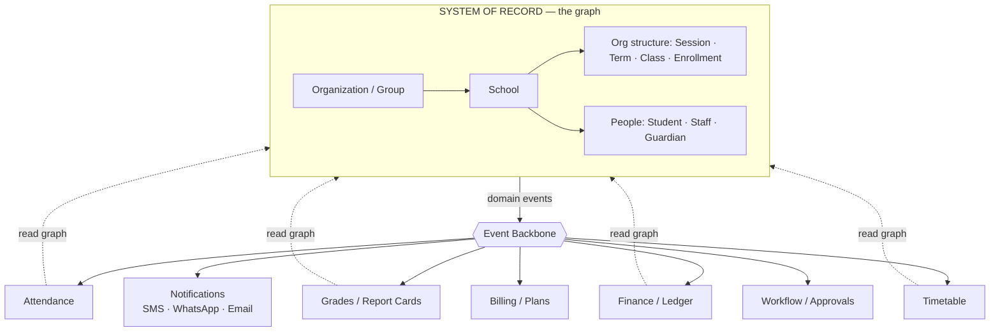
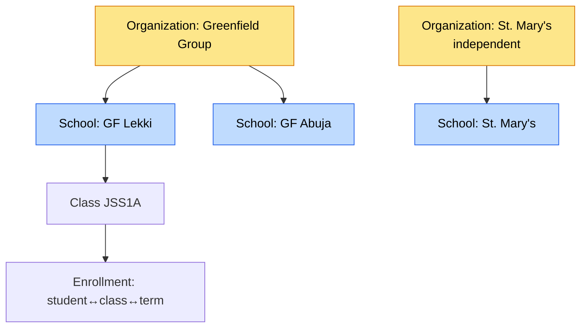
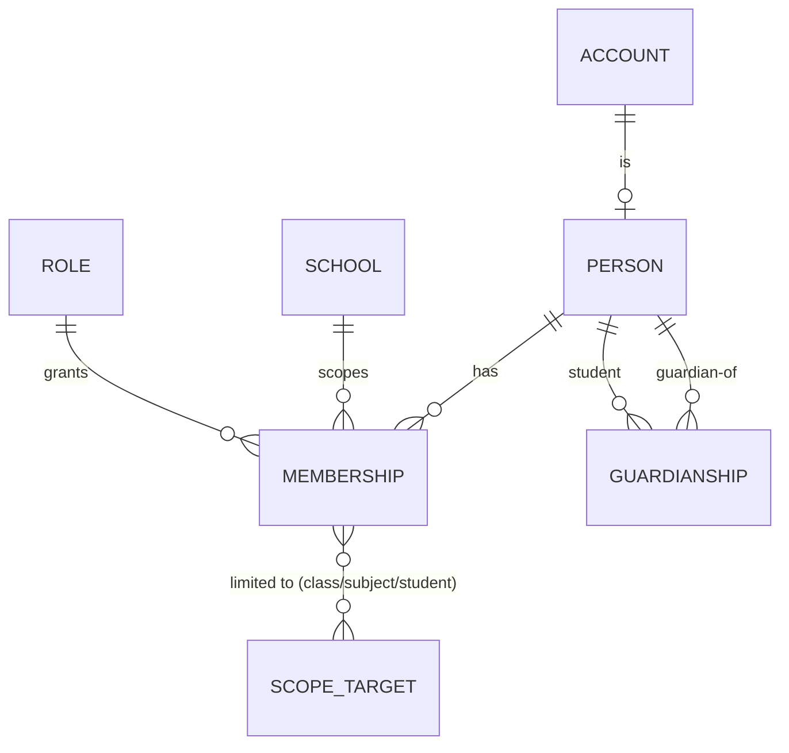
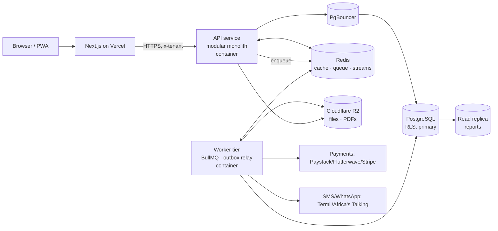
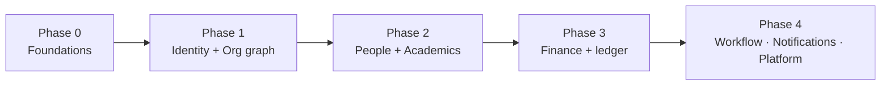

# Aeon Platform Architecture — First-Principles System Design
## "Rippling for academic institutions" — the system of record for schools

> Status: **proposed target architecture** (not yet implemented). This document
> describes where the platform is headed and why. The live system today is the
> Express/Mongoose modular monolith described under "Context" — this is the
> design we migrate toward, phase by phase (see §6).

---

## Context

**Why this document exists.** Aeon today is a working multi-tenant school SaaS: an Express/Mongoose modular monolith on Vercel serverless, shared-schema tenancy (`institution` field on every doc), JWT+refresh auth across three portals, ~16 domain models, no eventing/queue/cache tier. It works — but it was grown feature-by-feature, not designed to *last*. The product ambition (per the MVP map: People, Academics, Finance, Setup/config, approval workflows, billing) is not a school CRUD app — it's **an ERP/system-of-record for academic institutions**, the schools equivalent of Rippling/Deel/SeamlessHR.

This document reasons from first principles about the architecture that lets Aeon survive its own growth, and lays out the target design plus a migration path.

**Calibration (decided with the team):**
- **Change appetite:** *Greenfield core* — design the ideal target; port features over.
- **Datastore:** *Open to Postgres* for the system of record.
- **Org scope:** *Both, eventually* — start with independent schools, but the model must not block school groups/districts/chains later.
- **Market:** *African-first, global-ready* — SMS/mobile-money/multi-curriculum now, but payments/notifications/curriculum stay pluggable for other regions.

---

## 1. First principles — what is invariant about this domain

Strip away features and these truths remain. Every decision below traces back to one of them.

1. **There is one source of truth: the people-and-org graph.** Students, staff, guardians, and the org structure (school → session → term → class → enrollment) are the spine. *Every* module (attendance, grades, fees, timetable, reports) is a projection over this graph. Rippling's moat isn't payroll or IT — it's that all modules read/write one employee graph. Aeon's moat is the same insight applied to schools. **The graph is the product; modules are lenses.**
2. **A change in the source of truth must ripple outward automatically.** Enroll a student → fees get assigned, a class roster updates, a guardian gets invited, an attendance register gains a row. If modules each re-implement "what happens on enrollment," the system rots. This demands an **event backbone**, not point-to-point calls.
3. **The domain is deeply relational and handles money.** students↔classes↔subjects↔grades↔terms↔fees↔payments. Money needs correctness (no lost payments, idempotent webhooks, auditable balances). This pushes hard toward a **relational store with transactions and a ledger**.
4. **Schools are not uniform.** Grading scales, term vs. semester systems, promotion rules, fee schedules, curricula (WAEC/NECO/British/American) differ per school and per country. A platform that lasts encodes these as **config-as-data**, never as branches in code.
5. **Institutions are hierarchical and humans are multi-role.** A proprietor runs 5 campuses; a person is a teacher at one school and a guardian of two children; a student becomes an alumnus. Identity must model **one human, many relationships**, and tenancy must be **hierarchy-ready**.
6. **Trust is non-negotiable.** A cross-tenant leak is existential. Isolation must be enforced **at the data layer**, not only in app middleware that someone can forget to call.
7. **Connectivity is unreliable and guardians live on phones.** African-first means **SMS/WhatsApp over email**, **mobile-money rails**, and APIs that tolerate **intermittent connectivity** (idempotent, client-ID-friendly writes).

---

## 2. The core thesis

> **Build a System of Record (the people + org graph) with hard module boundaries, an event backbone that lets modules compose, and config-as-data so one codebase serves every school. Everything else is a consequence.**



Modules never reach into each other's tables. They **read the graph** through service interfaces and **react to events**. That is what makes a 5-module system extend to 20 without becoming a ball of mud.

---

## 3. Architecture decisions (with tradeoffs)

Each is a mini-ADR: the decision, why, the cost, and what we explicitly reject.

### ADR-1 — Datastore: **PostgreSQL** for the system of record (JSONB for the flexible parts)

**Decision.** PostgreSQL is the primary store. Relational tables for the graph and money; `JSONB` columns for genuinely variable data (grading scales, fee item lists, school settings, report-card templates).

**Why (first principles 3, 4, 6):**
- **Referential integrity.** Foreign keys make "a Grade referencing a deleted Student" *impossible*. Mongo cannot; today nothing enforces it.
- **Transactions across tables.** "Enroll student + assign term fees + add to roster" commits atomically or not at all.
- **Joins for reporting.** Class result sheets, fee-collection rates, attendance summaries are joins — Postgres's home turf; in Mongo they're `$lookup` gymnastics or app-side stitching.
- **Row-Level Security (RLS).** Tenant isolation enforced *in the database* via policies keyed on a session variable. This **eliminates the entire class of "forgot the institution filter" bugs**. Defense in depth: app scopes *and* DB enforces.
- **JSONB keeps Mongo's upside.** The flexible config that made Mongo attractive lives in `JSONB` with GIN indexes — schema-flexible *and* relational, in one engine.

**Cost / what we accept.** Data migration from Mongo; the team learns SQL + migrations discipline; we add a migration tool. Greenfield-core is precisely the right moment to pay this.

**Tooling.** Drizzle ORM (SQL-first, fully typed, first-class migrations), with connection pooling via PgBouncer (transaction mode) so the API tier scales without exhausting Postgres connections.

**Drizzle vs Sequelize — why Drizzle wins for this system:**

| Dimension | **Drizzle** | **Sequelize** | Why it matters here |
|---|---|---|---|
| **Type safety** | Types are *inferred from the schema*; queries are end-to-end typed, including joins and partial selects | Types are bolted on (`@types`/decorators); weaker inference, easy to drift from runtime | A financial/relational core can't afford "the column exists but TS didn't know" bugs |
| **Query model** | SQL-first: the query you write is the SQL that runs — predictable plans | Heavy abstraction/"magic"; generated SQL can surprise you on complex joins | Our hot paths (result sheets, fee collection, ledger sums) are join-heavy; we need to *see* and tune the SQL |
| **Migrations** | `drizzle-kit` diffs schema → generates SQL migrations you review and version | Migrations are hand-written JS or via umzug; schema and migrations drift more easily | Greenfield + RLS means migrations are first-class; we want generated, reviewable SQL |
| **RLS / raw SQL** | Trivial to drop to raw SQL (`sql\`...\``) for `SET app.current_school`, policies, CTEs, window functions | Possible but awkward; fights the ORM | Tenant context (ADR-2) and reporting lean on raw SQL constructs |
| **Runtime weight** | Tiny, no decorators, no heavy model classes; fast cold starts | Larger runtime, class-model boilerplate | Lean services, cheap to run, easy to reason about |
| **Lineage / direction** | Modern, TS-native, actively evolving | Mature but callback-era roots; momentum has slowed | Betting the platform's next 5 years on the actively-invested tool |
| **Sequelize's edge** | — | Batteries-included: built-in validations, hooks, broad ecosystem, long track record | We get validation from Zod at the edge and FKs/constraints in Postgres — we don't need the ORM to own it |

Net: Sequelize optimizes for "ORM does everything"; Drizzle optimizes for "typed, transparent SQL." For a money-handling, join-heavy, RLS-based system where we want to *control and see* the SQL, Drizzle is the better fit. (Kysely is a close runner-up — pure query builder — but Drizzle's schema-as-source-of-truth + `drizzle-kit` migrations tips it.)

**Rejected:** *Stay on Mongo with discipline* — discipline is exactly what fails at 3am; RLS + FKs make correctness structural, not aspirational. *Database-per-tenant from day one* — see ADR-2.

---

### ADR-2 — Tenancy: **pooled shared-schema + RLS**, hierarchy-ready, with a **silo escape hatch**

**Decision.** One schema; every tenant-owned row carries `school_id` (and denormalized `org_id`). Postgres **RLS policies** filter every query by the current tenant set in a per-request session variable (`SET app.current_school`). Introduce `organization` as the parent of `school` now (even if every org currently has one school) so groups/districts slot in without a rewrite. Provide a **silo path**: a very large tenant can be relocated to a dedicated schema/database, same code, routed by a tenant→connection map.

**Why (first principles 5, 6):**
- Pooled is cheapest to operate at hundreds–thousands of small/medium schools (the bulk of the market).
- RLS is the durable isolation guarantee (ADR-1).
- Modeling `organization` now is nearly free; retrofitting hierarchy onto a flat tenant model later is a migration nightmare.
- The silo hatch handles the eventual whale (a 20-campus district) without forcing premature complexity on everyone.



Tenant context resolves to a **school** by default; **org-level roles** (a director) can be scoped to span all schools in their org. This generalizes today's `tenantResolver` cleanly.

**Cost.** RLS adds a mandatory "set tenant" step per request (middleware) and careful policy authoring. The silo hatch needs connection routing. Both are bounded, well-trodden patterns.

**Rejected:** *DB-per-tenant default* (ops explosion, migrations × N, cross-tenant analytics pain); *app-only filtering* (the status quo — one forgotten filter = breach).

---

### ADR-3 — Service architecture: **modular monolith with enforced boundaries** (extract services only on evidence)

**Decision.** A single deployable backend, internally partitioned into domain modules (identity, people, academics, finance, notifications, billing, workflow, platform). Each module **owns its tables**, exposes a typed **service interface**, and may **emit/consume events** — but **must not import another module's models or query its tables directly**. Enforce the boundary with lint rules / package structure (e.g. modules as workspace packages with explicit public exports).

**Why (first principles 1, 2):**
- Microservices buy independent scaling/deploys at the cost of distributed-systems tax (network failure, eventual consistency everywhere, ops, debugging). At Aeon's stage that's pure cost, no payback.
- A modular monolith with hard internal seams gives **90% of the decoupling for 10% of the cost**, and — critically — preserves the *option* to extract a module into a service later (notifications and billing are the likely first candidates) with no rewrite, because the seam already exists.
- The current per-domain folder layout is already close; we add **boundary enforcement** and **events between modules** instead of direct cross-imports.

**Cost.** Discipline + tooling to prevent boundary violations. Worth it.

**Rejected:** *Microservices now* (premature); *unstructured monolith* (today's trajectory → mud).

---

### ADR-4 — Identity & access: **unified accounts, one-human-many-relationships, RBAC+scope → ReBAC**

**Decision.** Separate **authentication identity** from **domain relationships**:

- `account` — one per human login (email/phone, credential, MFA, status). Auth only.
- `person` — the human and their PII (name, dob, photo). A student/staff/guardian is a `person`.
- `membership` — the join: `account/person × school × role × scope`. "This person is a *teacher* at *GF Lekki* with scope = {these classes, these subjects}." A guardian membership links to the students they're responsible for.

Access control: **RBAC + scope** now (role grants verbs; scope limits the rows — e.g. a teacher edits grades only for subjects/classes in their membership scope). Make the unused `permissions[]` real by expressing checks through a **central policy module**. Evolve toward **ReBAC** (relationship-based, Zanzibar-style: "can edit grade if teaches(subject) ∧ assigned(class)") when fine-grained sharing demands it.

**Why (first principles 5).** One human is a teacher *and* a parent of two kids — possibly across two schools. Today's "Staff" and "Student" as separate top-level identities can't express that without duplication. Guardians (already on the MVP map) make this unavoidable. The 3-portal frontend stays; it just resolves to memberships under one identity model.



**Where "staff management" lives.** A staff member is **not** a separate top-level type — it's a `person` (in the **People** module) carrying a `staff_profile` (employment/HR data: hire date, department, qualifications, employee number) **plus** one or more `membership` rows (in **Identity**) that grant role + scope. So:
- *HR/people-ops view* of staff (roster, profiles, departments, onboarding, documents) = **People** module (`person` + `staff_profile`). This is the Rippling-style "employee record."
- *Access view* of staff (what they can do, in which school, over which classes) = **Identity** module (`membership` → `role` + `scope`).
- The same `person` can simultaneously be a teacher (membership) **and** a guardian (guardianship edge), across one or more schools — impossible to express cleanly under today's separate Staff/Student tables.

This is exactly the HR-system parallel: Deel/Rippling have one *worker* record that payroll, IT, and benefits all hang off. Aeon has one *person* record that HR, access, academics, and finance hang off.

**Cost.** More tables than "Staff/Student"; auth flows resolve through `membership`. But it's the difference between a platform and a CRUD app.

**Rejected:** *Separate identity per role* (status quo — duplication, can't model siblings/guardians/multi-school staff).

---

### ADR-5 — Event backbone: **transactional outbox → bus**, start simple

**Decision.** Domain writes and a corresponding **event row** commit in the *same Postgres transaction* (the **outbox pattern**). A relay process publishes outbox rows to a bus. Start with **Postgres `LISTEN/NOTIFY` or Redis Streams**; graduate to Kafka/NATS only when volume demands. Modules subscribe to events they care about.

**Why (first principles 1, 2).** This is the mechanism that makes the graph "ripple." `StudentEnrolled` → finance assigns fees, academics seeds the register, notifications invites the guardian — each module owns its reaction, none knows about the others. No dual-write inconsistency because the event is committed atomically with the state change.

```mermaid
sequenceDiagram
    autonumber
    participant API as Enrollment (People module)
    participant DB as Postgres (state + outbox, 1 txn)
    participant RLY as Outbox Relay
    participant BUS as Event Bus
    participant FEE as Finance
    participant ACA as Academics
    participant NTF as Notifications

    API->>DB: BEGIN; insert enrollment; insert event(StudentEnrolled); COMMIT
    RLY->>DB: poll/LISTEN new outbox rows
    RLY->>BUS: publish StudentEnrolled
    BUS->>FEE: StudentEnrolled → assign term fees (ledger)
    BUS->>ACA: StudentEnrolled → create attendance register row
    BUS->>NTF: StudentEnrolled → SMS guardian invite
```

**Cost.** Outbox table + relay + idempotent consumers (handlers must tolerate redelivery). Standard, well-understood.

**Rejected:** *Direct synchronous cross-module calls* (tight coupling, partial-failure hell); *naive publish-after-commit* (dual-write race → lost events).

---

### ADR-6 — Async & jobs: **queue + dedicated worker tier**

**Decision.** A job queue (**BullMQ on Redis**) with a separate **worker process**. Crons for time-based work.

**Why.** Today everything is synchronous in a request — fatal for: report-card/transcript **PDF generation**, **bulk CSV imports**, end-of-term **processing**, scheduled **fee reminders (SMS)**, **billing runs**, **exports**, and **notification fan-out**. These are slow, bursty, retryable — exactly what a queue is for, and exactly what serverless request handlers are bad at.

**Cost.** A second runtime (worker) + Redis. Necessary the moment PDFs or SMS exist.

---

### ADR-7 — Runtime/topology: **Next.js on Vercel; API + workers on a long-running container**

**Decision.** Keep the **frontend on Vercel**. Move the **backend API and workers to a container platform** (Fly/Render/Railway/ECS) with **Postgres + Redis** managed nearby. Object storage stays **Cloudflare R2**.

**Why.** Pure serverless fights this workload: Postgres connection pooling needs PgBouncer + care; long jobs exceed request models; the outbox relay and workers are inherently long-running; predictable latency matters for grade/attendance entry. A long-running service with a real pool, plus a worker tier, is the natural fit. (Vercel Fluid Compute narrows the gap for the API, but workers/relay still want a persistent process.)



**Cost.** Slightly more infra than "all on Vercel," but it's the difference between a demo and an ERP. Web stays serverless (great DX, previews).

---

### ADR-8 — Money: **append-only ledger + idempotency + multi-currency by default**

**Decision.** Finance is a **double-entry-inspired, append-only ledger**: immutable `ledger_entry` rows; balances are *derived* (or maintained transactionally with row locks), never blindly mutated.

- **Money is always `(amount_minor: bigint, currency: char(3) ISO-4217)`** — integer minor units (kobo/cents), **never floats**, and **every** monetary column (fee item, invoice line, ledger entry, payment) carries its own currency. There is no implicit "platform currency." A school operates in its currency (NGN, GHS, KES, USD…); the platform is multi-currency from row one.
- **No silent cross-currency arithmetic.** You may only sum/compare entries of the same currency. If a school ever takes payment in a different currency than the invoice, that's an explicit **FX conversion entry** (rate, source, timestamp recorded) — a first-class ledger event, not a rounding fudge.
- **Idempotency everywhere money moves.** Every external payment and webhook carries an **idempotency key**; gateways **retry webhooks**, so handlers dedupe and are safe to replay. Refunds/adjustments/reversals are **new entries**, never edits.

**Why (first principles 3 + global-ready).** Today's `FeePayment.payments[]` with a computed `balance` is fragile under concurrency, single-currency by assumption, and impossible to *reconcile* or *audit* cleanly. Storing currency on every amount means onboarding a Ghanaian and a Kenyan school needs **zero schema change** — and a future US/EU school slots in the same way. A ledger is the only design that's auditable, concurrency-safe, reversible, and currency-correct.

**Cost.** More rigorous finance model + currency discipline in every query and UI. Non-negotiable for anything touching money across regions.

---

### ADR-9 — Configurability: **config-as-data**, versioned, with org/global defaults

**Decision.** Grading scales, term/semester systems, promotion rules, fee schedules, curricula, and report-card templates are **data** (typed `JSONB` + versioned template rows), owned per school, inheriting defaults from org → global. Code reads config; code contains *no* per-school branches.

**Why (first principles 4).** This is the single biggest longevity lever. It's what lets one deployment serve a Lagos WAEC school and a Nairobi British-curriculum school without forking. Versioning matters because a grading scale change must not retroactively rewrite last term's report cards.

**Cost.** A config/registry module and a template engine. Pays for itself by the third differently-shaped school.

---

### ADR-10 — Workflow & approvals: **one reusable engine**

**Decision.** A generic engine: `workflow_definition` (steps, approvers by role/scope, transitions) → `workflow_instance` → `task`. Drives result approval (teacher → HOD → principal), fee waivers, admissions, leave, app activation.

**Why.** "Approval workflow" is explicit on the MVP map, and HR-style platforms *are* workflow engines at heart. Build it once as a primitive; every module gets approvals for free. Bespoke per-feature approval logic is the slow road to duplication.

**Cost.** Upfront engine design. High leverage as modules multiply.

---

### ADR-11 — Integrations & market: **pluggable providers, sync-friendly API, public API + webhooks**

**Decision.**
- **Payments:** a single **`PaymentProvider` abstraction** that the finance core talks to — it never knows which gateway is live. **Paystack and Flutterwave are the first two implementations** (both first-class, selectable per school/per currency); **Stripe and others slot in later** by adding an implementation, with **no change to finance/ledger code**. The interface is the contract:
  ```ts
  interface PaymentProvider {
    readonly name: 'paystack' | 'flutterwave' | 'stripe' | string
    supports(currency: string): boolean
    initiatePayment(p: { amountMinor: bigint; currency: string; reference: string;
                         idempotencyKey: string; customer: PayerRef; metadata?: object }): Promise<InitResult>
    verifyWebhook(req: RawRequest): WebhookEvent          // signature check per provider
    parseEvent(evt: WebhookEvent): NormalizedPaymentEvent // → one canonical shape the ledger consumes
    refund(p: { paymentId: string; amountMinor: bigint; idempotencyKey: string }): Promise<RefundResult>
  }
  ```
  Each provider verifies its **own webhook signature** and normalizes to **one canonical event** the ledger consumes; idempotency keys (ADR-8) make replays safe. A school picks a provider per currency (e.g. Paystack for NGN, Flutterwave for cross-border), routed by `supports(currency)`.
- **Notifications:** a `Channel` interface (SMS/WhatsApp/email); **SMS-first** (Termii/Africa's Talking) for guardians; a notification service that consumes events (ADR-5).
- **Curriculum/grading:** config-as-data (ADR-9) per region.
- **Connectivity:** APIs are **idempotent and accept client-generated IDs**; attendance/grade entry tolerates offline via queue-and-sync on the client; PWA later. Optimistic concurrency (ETags/`updated_at` checks).
- **Platform:** a **public REST API + outbound webhooks** (built on the same event backbone) so third parties and school ICT teams integrate — the move from product to platform.

**Why (first principle 7 + global-ready).** Encodes the African-first reality without hard-coding it; other regions slot in by adding a provider, not editing core.

---

### ADR-12 — Reporting/analytics: **keep OLTP lean; replica now, warehouse later**

**Decision.** Operational reports run against a **read replica**. Cross-tenant analytics and super-admin dashboards eventually go to a **warehouse** (ClickHouse/BigQuery) fed by the event stream. Never analytics on the primary.

**Why.** Report generation is heavy and bursty (end of term). Isolating it protects transactional latency. The event backbone already gives a clean feed into a warehouse when that day comes.

---

## 4. Target domain model (the canonical graph)

```mermaid
erDiagram
    ORGANIZATION ||--o{ SCHOOL : contains
    SCHOOL ||--o{ ACADEMIC_SESSION : has
    ACADEMIC_SESSION ||--o{ TERM : has
    SCHOOL ||--o{ CLASS : has
    SCHOOL ||--o{ SUBJECT : offers

    ACCOUNT ||--o| PERSON : authenticates
    PERSON ||--o{ STAFF_PROFILE : "employment (HR)"
    PERSON ||--o{ MEMBERSHIP : holds
    SCHOOL ||--o{ MEMBERSHIP : scopes
    ROLE ||--o{ MEMBERSHIP : grants

    PERSON ||--o{ ENROLLMENT : "as student"
    CLASS ||--o{ ENROLLMENT : roster
    TERM  ||--o{ ENROLLMENT : during

    ENROLLMENT ||--o{ ATTENDANCE : generates
    PERSON ||--o{ GRADE : earns
    SUBJECT ||--o{ GRADE : in
    TERM ||--o{ GRADE : during

    CLASS ||--o{ TIMETABLE : scheduled
    TERM ||--o{ FEE_STRUCTURE : defines
    PERSON ||--o{ FEE_ACCOUNT : "student owes"
    FEE_ACCOUNT ||--o{ LEDGER_ENTRY : records

    PERSON ||--o{ GUARDIANSHIP : "guardian"
    GUARDIANSHIP }o--|| PERSON : "of student"

    SCHOOL ||--o{ OUTBOX_EVENT : emits
    SCHOOL ||--o{ WORKFLOW_INSTANCE : runs
    SCHOOL ||--o{ CONFIG : owns
```

Key shifts from today: `organization` above `school`; `account`/`person`/`membership` replace separate Staff/Student identities (a staff member = `person` + `staff_profile` for HR + `membership` for access; a student = `person` + `enrollment`; a guardian = `person` + `guardianship` — all the *same* identity primitive); `enrollment` is a first-class edge (student × class × term) that *generates* attendance and anchors grades; finance becomes `fee_account` + immutable `ledger_entry` (currency on every amount); `outbox_event`, `workflow_instance`, and `config` are platform primitives.

---

## 5. Module map (bounded contexts)

| Module | Owns | Emits | Consumes |
|---|---|---|---|
| **Identity** | account (login), membership, role, session/auth | `MembershipGranted` | `PersonCreated` |
| **Org & Academics-config** | organization, school, session, term, class, subject, config, calendar | `TermStarted`, `TermEnded`, `ClassCreated` | — |
| **People** | **person** (the human + PII), **staff_profile** (HR/employment), enrollment, guardianship | `PersonCreated`, `StaffHired`, `StudentEnrolled`, `StudentPromoted`, `StudentWithdrawn`, `GuardianLinked` | `TermStarted` |
| **Academics** | attendance, grade, report-card | `GradeRecorded`, `ResultsApproved` | `StudentEnrolled`, `TermEnded` |
| **Timetable** | timetable | `TimetablePublished` | `ClassCreated` |
| **Finance** | fee_structure, fee_account, ledger_entry, payment | `FeeAssigned`, `PaymentRecorded`, `InvoiceOverdue` | `StudentEnrolled`, `TermStarted` |
| **Notifications** | message log, templates, channels | `NotificationSent` | *many* (StudentEnrolled, PaymentRecorded, ResultsApproved, InvoiceOverdue…) |
| **Workflow** | workflow_definition/instance/task | `WorkflowCompleted` | module-specific submit events |
| **Billing (SaaS)** | plan, subscription, usage | `PlanChanged` | usage events |
| **Platform** | public API keys, webhooks, audit, outbox relay | — | all (audit + webhook fan-out) |

Boundary rule: a module touches another's data **only** via its service interface or by reacting to its events. Enforced structurally.

---

## 6. Migration path (greenfield core, ported feature-by-feature)

Even with a greenfield core, today's system stays live; we **strangle** it module by module behind a stable frontend API contract.



- **Phase 0 — Foundations.** Stand up Postgres (Drizzle + migrations), RLS scaffolding + tenant-context middleware, the modular-monolith skeleton with boundary enforcement, the outbox table + relay, Redis + a worker tier, CI. *Exit:* a trivial module (e.g. `subject`) runs end-to-end on the new stack behind the existing API shape.
- **Phase 1 — Identity + Org graph.** `account`/`person`/`membership`/`role`; `organization`→`school`→`session`/`term`/`class`. Port auth (3 portals resolve through memberships). *Exit:* login + tenant resolution on the new core; old Mongo auth retired.
- **Phase 2 — People + Academics.** `enrollment`, guardianship; attendance, grades, report cards; first real events (`StudentEnrolled` → register seed). Config-as-data for grading scales/term systems. *Exit:* a class can be enrolled, marked, graded, and a report card generated (PDF via worker).
- **Phase 3 — Finance + ledger.** `fee_structure`, `fee_account`, `ledger_entry`; Paystack/Flutterwave with idempotent webhooks; `StudentEnrolled`→`FeeAssigned`. *Exit:* assign fees, take a mobile-money payment, reconcile, see an auditable balance.
- **Phase 4 — Workflow · Notifications · Platform.** Approval engine (results, waivers, app activation); SMS-first notifications consuming events; public API + webhooks; SaaS billing/plans; read replica for reports. *Exit:* result-approval flow + guardian SMS + an overdue-fee reminder all driven by events.

Each phase ships behind the unchanged frontend contract; the old path is removed only once its replacement is verified.

---

## 7. Tradeoff summary (the honest scorecard)

| Decision | We gain | We pay | We reject |
|---|---|---|---|
| Postgres + JSONB | integrity, transactions, joins, **RLS isolation** | migration, SQL discipline | Mongo-with-discipline |
| Pooled + RLS, hierarchy-ready, silo hatch | cheap ops + structural isolation + future groups | tenant-context plumbing | DB-per-tenant default; app-only filtering |
| Modular monolith + hard seams | decoupling without distributed tax; extractable later | boundary enforcement effort | microservices now |
| Unified identity (account/person/membership) | siblings, guardians, multi-role, multi-school | more tables; richer auth | identity-per-role |
| Outbox + event bus | modules compose; no dual-write loss | idempotent consumers; relay | sync cross-calls |
| Queue + worker tier | PDFs, imports, SMS, billing done right | a second runtime + Redis | sync-in-request |
| Container API/workers + Vercel web | pooling, long jobs, predictable latency | a bit more infra | all-serverless backend |
| Ledger + idempotency + multi-currency | auditable, concurrency-safe, currency-correct money; new regions = no schema change | stricter finance model + currency discipline | mutable balance field; single-currency assumption |
| `PaymentProvider` abstraction | Paystack + Flutterwave now, Stripe later with no finance changes | one interface to maintain | gateway-specific code in finance core |
| Config-as-data | one codebase for every school/region | config engine + templates | per-school code branches |
| Workflow engine | approvals everywhere, free | upfront engine | bespoke per feature |

---

## 8. Verification — how we know the design holds

This is a design plan; "tests" are architectural acceptance checks per phase:

1. **Isolation (structural):** with RLS on, a query *without* tenant context returns **zero rows**; a deliberately omitted app filter still cannot leak across schools (RLS catches it). Add an automated test that runs a cross-tenant read and asserts empty.
2. **Ripple:** enrolling a student (one API call) produces — via events — a fee account, an attendance register row, and a queued guardian SMS. Assert all three side effects from the single action.
3. **Money correctness:** replay the same Paystack **or** Flutterwave webhook 3× → exactly **one** credit; balance derived from the ledger matches the sum of entries; a refund is a new entry, never an edit. **Multi-currency:** a school invoicing in GHS and another in NGN both reconcile correctly with **zero schema change**; any attempt to sum across currencies is rejected, not silently coerced. **Provider abstraction:** swapping a school's gateway from Paystack to Flutterwave requires **no change** to finance/ledger code — only provider selection — and a stub provider lets finance be tested with no live gateway.
4. **Configurability:** two schools with different grading scales/term systems produce correct, *different* report cards from the *same* code path; changing a scale does not alter last term's stored cards (versioning).
5. **Hierarchy:** a director with an org-scoped membership reads across all schools in their org; a school-admin cannot. A single `person` holding teacher + guardian memberships sees both portals' data, correctly scoped.
6. **Boundaries:** a CI check fails the build if module A imports module B's models/tables directly.
7. **Load posture:** end-of-term report generation runs on the worker tier + read replica without degrading API p95 latency (measure under a simulated term-end burst).

---

## 9. What to decide next (open questions for implementation)

- **ORM:** Drizzle (recommended) vs Kysely vs Prisma — confirm before Phase 0.
- **Container host:** Fly vs Render vs Railway vs ECS — driven by region/latency to target schools and managed-Postgres preference.
- **Bus tech for v1:** Postgres `LISTEN/NOTIFY` (simplest) vs Redis Streams (more robust) — both upgrade to Kafka/NATS later.
- **PDF pipeline:** HTML→PDF (Playwright/Puppeteer in worker) vs a templating service — affects report-card fidelity.
- **Data migration tactic:** dual-write during cutover vs per-module ETL snapshots.

These don't change the architecture; they're swappable implementations within it.
